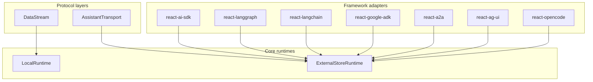

assistant-ui exposes runtime integrations at three layers. Understanding which layer you are picking from clarifies what each runtime gives you and how features flow between them.

## The three layers

Each upper layer is implemented in terms of a lower one. You can drop down a layer whenever you need more control, but most users start at the framework layer and never touch the others.

## Core runtimes

These own everything assistant-ui considers a runtime: messages, threads, branching, edit and regenerate state, run lifecycle. Every other layer is built on one of them.

**`LocalRuntime`** keeps state inside the runtime itself and exposes a `ChatModelAdapter` interface. You implement a single `run` function (or `async *run` for streaming) and the runtime takes care of branching, editing, regeneration, and history through built-in plumbing.

**`ExternalStoreRuntime`** is the inverse: you own the message array and provide callbacks (`onNew`, `onEdit`, `onReload`, etc.). The runtime renders whatever you give it. UI features turn on based on which callbacks are present.

| Concern | LocalRuntime | ExternalStoreRuntime |
| --- | --- | --- |
| State ownership | Runtime | You |
| Setup complexity | Low | Medium |
| Branching | Built in | Requires `setMessages` |
| Editing | Built in | Requires `onEdit` |
| Best fit | Greenfield projects | Redux, zustand, tanstack-query stacks |

See [LocalRuntime](/docs/runtimes/custom/local-runtime) and [ExternalStoreRuntime](/docs/runtimes/custom/external-store) for full guides.

## Protocol layers

These wrap a core runtime with a wire-protocol contract so a generic backend can talk to assistant-ui without writing a custom `ChatModelAdapter` each time.

**`DataStream`** is a message-streaming protocol. Your backend emits a standardized stream of message parts (text deltas, tool calls) and `useDataStreamRuntime` consumes it on top of `LocalRuntime`. Closest to "AI SDK style streaming for any backend".

**`AssistantTransport`** is a state-streaming protocol. Your backend sends snapshots of its agent state and the runtime converts them into UI messages on top of `ExternalStoreRuntime`. Closest to "stream the whole agent state, not just messages".

| Protocol | Layered on | Choose when |
| --- | --- | --- |
| DataStream | LocalRuntime | Your backend already speaks the data stream protocol, or you want a thin message-stream contract |
| AssistantTransport | ExternalStoreRuntime | Your agent has internal state worth surfacing, or you need bidirectional commands and custom command types |

## Framework adapters

The fastest path. Each adapter wraps one of the core or protocol layers and adds framework-specific conveniences.

| Adapter | Layered on | Targets |
| --- | --- | --- |
| `react-ai-sdk` | `ExternalStoreRuntime` | Vercel AI SDK v6 (`useChat`) |
| `react-langgraph` | `ExternalStoreRuntime` | LangGraph Cloud via `@langchain/langgraph-sdk` |
| `react-langchain` | `ExternalStoreRuntime` | LangGraph Cloud via `@langchain/react`'s `useStream` |
| `react-google-adk` | `ExternalStoreRuntime` | Google ADK JS or Python agents |
| `react-a2a` | `ExternalStoreRuntime` | Any A2A v1.0 protocol server |
| `react-ag-ui` | `ExternalStoreRuntime` | AG-UI protocol agents (CopilotKit, custom servers) |
| `react-opencode` | `ExternalStoreRuntime` | OpenCode coding-agent server (experimental) |

When an adapter exposes a feature like attachments, speech, or feedback, it does so through the same [adapter interfaces](/docs/runtimes/concepts/adapters) the core runtimes use. A feature implemented once works the same way across runtimes.

## How features flow

A few things follow predictable patterns regardless of layer:

- **Adapters** (attachments, speech, feedback, history, suggestions) are configured the same way and carry the same contract everywhere. See [adapters](/docs/runtimes/concepts/adapters).
- **Threads** (single, cloud, custom database) work via a shared `RemoteThreadListAdapter` for `LocalRuntime`-based runtimes and a separate `ExternalStoreThreadListAdapter` for `ExternalStoreRuntime`. See [threads](/docs/runtimes/concepts/threads).
- **Unstable APIs** are surfaced with an `unstable_` prefix and may change in any release. See [stability](/docs/runtimes/concepts/stability).

## Choosing a layer

Start at the top, descend only when blocked.

1. **Framework adapter** if your backend matches one. You get streaming, threads, and adapter slots without writing protocol code.
2. **Protocol layer** if no framework adapter fits but you can pick a wire format. `DataStream` for message streaming, `AssistantTransport` for state streaming.
3. **Core runtime** if your situation is too custom for a protocol. `LocalRuntime` for simple cases, `ExternalStoreRuntime` if you already have a store.

If you are unsure, start at [picking a runtime](/docs/runtimes/pick-a-runtime).

## Related

<Cards>
  <Card
    title="Adapters"
    description="Attachments, speech, feedback, history, suggestions across runtimes."
    href="/docs/runtimes/concepts/adapters"
  />
  <Card
    title="Threads"
    description="Multi-thread support: cloud, custom database, ExternalStore."
    href="/docs/runtimes/concepts/threads"
  />
  <Card
    title="Stability"
    description="What unstable_ means and which APIs may change."
    href="/docs/runtimes/concepts/stability"
  />
</Cards>
