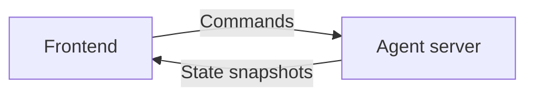
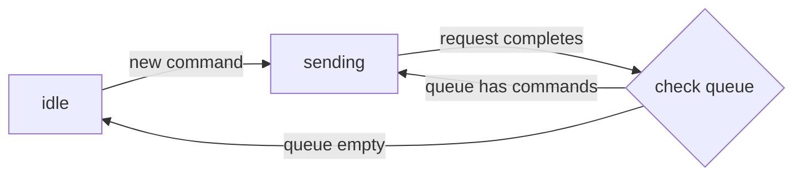

`AssistantTransport` is a state-streaming protocol layered on `ExternalStoreRuntime` (see [architecture](/docs/runtimes/concepts/architecture)). Instead of streaming message parts, your backend streams snapshots of its full agent state and the runtime converts them into UI messages.

Three things make this useful:

- **State streaming** — efficient updates to your agent state (any JSON object).
- **UI integration** — your agent's native state becomes assistant-ui messages.
- **Command handling** — user actions (messages, tool results, custom commands) flow back to the agent.

## When to use it

Pick `AssistantTransport` when:

- Your backend does not have a streaming protocol yet and you want one.
- Your agent has internal state worth surfacing in the UI directly.
- You are building a custom agent framework or one without a streaming protocol (e.g. open-source LangGraph).
- You need bidirectional commands beyond simple message turns.

If you only need message streaming, [DataStream](/docs/runtimes/custom/data-stream) is simpler.

## Mental model



The frontend receives state snapshots and converts them to React components. The UI is a stateless view on top of the agent state.

The agent server receives commands from the frontend. When a user interacts with the UI (sends a message, clicks a button), the frontend queues a command and sends it. `AssistantTransport` defines `add-message` and `add-tool-result`; you can define more.

### Command lifecycle


The runtime alternates between **idle** (no active backend request) and **sending** (request in flight). When a new command is created while idle, it is sent immediately; otherwise it is queued until the current request completes.



To implement this you build two pieces:

1. **Backend endpoint** that accepts commands and returns a stream of state snapshots.
2. **Frontend state converter** that maps state snapshots to assistant-ui's data format.

## Building a backend endpoint

The endpoint receives POST requests with this payload:

```ts
{
  state: T,                                     // previous state the frontend has
  commands: AssistantTransportCommand[],
  system?: string,
  tools?: Record<string, ToolJSONSchema>,       // tool definitions keyed by name
  threadId: string | null,                      // null for new threads
  parentId?: string | null,                     // present when editing or branching
  callSettings?: { maxTokens, temperature, topP, presencePenalty, frequencyPenalty, seed },
  config?: { apiKey, baseUrl, modelName },
}
```

<Callout type="warn">
The previous wire shape spread `callSettings` and `config` fields at the top level (e.g. `body.modelName`). Both formats are sent for compatibility, but the top-level fields are deprecated. Read from the nested objects.
</Callout>

The endpoint returns a stream of state snapshots using the [`assistant-stream`](https://www.npmjs.com/package/assistant-stream) library ([PyPI](https://pypi.org/project/assistant-stream/)).

### Handling commands

```python
for command in request.commands:
    if command.type == "add-message":
        # Handle adding a user message
    elif command.type == "add-tool-result":
        # Handle tool execution result
    elif command.type == "my-custom-command":
        # Handle your custom command
```

### Streaming updates

Mutate `controller.state` inside your run callback:

```python
from assistant_stream import RunController, create_run
from assistant_stream.serialization import DataStreamResponse

@app.post("/assistant")
async def chat_endpoint(request: ChatRequest):
    async def run_callback(controller: RunController):
        controller.state["message"] = "Hello"      # emits "set" at ["message"]
        controller.state["message"] += " World"     # emits "append-text"

    stream = create_run(run_callback, state=request.state)
    return DataStreamResponse(stream)
```

State changes are automatically streamed using the operations described in [streaming protocol](#streaming-protocol).

### Cancellation

`create_run` exposes `controller.is_cancelled` and `controller.cancelled_event`. If the response stream closes early (user cancel, client disconnect), these are set so your loop can exit cleanly. `create_run` gives callbacks a ~50ms cooperative shutdown window before forced cancellation. Put critical cleanup in `finally` blocks.

```python
async def run_callback(controller: RunController):
    while not controller.is_cancelled:
        await asyncio.sleep(0.05)
```

```python
async def run_callback(controller: RunController):
    await controller.cancelled_event.wait()
    # cancellation-aware shutdown
```

### Backend reference implementation

<Tabs items={["Custom agent", "LangGraph"]}>
<Tab value="Custom agent">

```python
from assistant_stream.serialization import DataStreamResponse
from assistant_stream import RunController, create_run

@app.post("/assistant")
async def chat_endpoint(request: ChatRequest):
    async def run_callback(controller: RunController):
        if controller.state is None:
            controller.state = {"messages": []}

        for command in request.commands:
            if command.type == "add-message":
                controller.state["messages"].append(command.message)

        async for message in your_agent.stream():
            controller.state["messages"].append(message)

    stream = create_run(run_callback, state=request.state)
    return DataStreamResponse(stream)
```

</Tab>
<Tab value="LangGraph">

```python
from assistant_stream.serialization import DataStreamResponse
from assistant_stream import RunController, create_run
from assistant_stream.modules.langgraph import append_langgraph_event

@app.post("/assistant")
async def chat_endpoint(request: ChatRequest):
    async def run_callback(controller: RunController):
        if controller.state is None:
            controller.state = {"messages": []}

        input_messages = []
        for command in request.commands:
            if command.type == "add-message":
                text_parts = [
                    p.text for p in command.message.parts
                    if p.type == "text" and p.text
                ]
                if text_parts:
                    input_messages.append(HumanMessage(content=" ".join(text_parts)))

        async for namespace, event_type, chunk in graph.astream(
            {"messages": input_messages},
            stream_mode=["messages", "updates"],
            subgraphs=True,
        ):
            append_langgraph_event(controller.state, namespace, event_type, chunk)

    stream = create_run(run_callback, state=request.state)
    return DataStreamResponse(stream)
```

</Tab>
</Tabs>

Full LangGraph example: [`python/assistant-transport-backend-langgraph`](https://github.com/assistant-ui/assistant-ui/tree/main/python/assistant-transport-backend-langgraph).

## Streaming protocol

assistant-stream replicates an arbitrary JSON object via two operations.

### Operations

These two operations cover all complex state mutations: `set` for value updates and structure, `append-text` for efficient streaming of text content.

#### `set`

```json
// Operation
{ "type": "set", "path": ["status"], "value": "completed" }

// Before
{ "status": "pending" }

// After
{ "status": "completed" }
```

#### `append-text`

```json
// Operation
{ "type": "append-text", "path": ["message"], "value": " World" }

// Before
{ "message": "Hello" }

// After
{ "message": "Hello World" }
```

### Wire format

<Callout type="warn">
The wire format will migrate to Server-Sent Events (SSE) in a future release.
</Callout>

Inspired by [AI SDK's data stream protocol](https://sdk.vercel.ai/docs/ai-sdk-ui/stream-protocol).

**state update:**

```
aui-state:[{"type":"set","path":["status"],"value":"completed"}]
```

**error:**

```
3:"error message"
```

## Building a frontend

`useAssistantTransportRuntime` accepts:

```ts
{
  initialState: T,
  api: string,
  resumeApi?: string,
  protocol?: "data-stream" | "assistant-transport",
  converter: (state: T, connectionMetadata: ConnectionMetadata) => AssistantTransportState,
  headers?: Record<string, string> | Headers | (() => Promise<Record<string, string> | Headers>),
  body?: object | (() => Promise<object | undefined>),
  prepareSendCommandsRequest?: (body: SendCommandsRequestBody) => Record<string, unknown> | Promise<Record<string, unknown>>,
  capabilities?: { edit?: boolean },
  adapters?: { attachments?: AttachmentAdapter; history?: ThreadHistoryAdapter },
  onResponse?: (response: Response) => void,
  onFinish?: () => void,
  onError?: (error: Error, params: { commands: AssistantTransportCommand[]; updateState: (updater: (state: T) => T) => void }) => void | Promise<void>,
  onCancel?: (params: { commands: AssistantTransportCommand[]; updateState: (updater: (state: T) => T) => void; error?: Error }) => void
}
```

### State converter

The state converter transforms your agent state into assistant-ui's message format:

```ts
(
  state: T,
  connectionMetadata: {
    pendingCommands: Command[],          // commands not yet sent
    isSending: boolean,                  // a request is in flight
    toolStatuses: Record<string, ToolExecutionStatus>,
  },
) => {
  messages: ThreadMessage[],
  isRunning: boolean,
  state?: ReadonlyJSONValue,
};
```

### Converting messages

`unstable_createMessageConverter` transforms agent messages to assistant-ui's format:

<Tabs items={["Example", "LangChain"]}>
<Tab value="Example">

```ts
import { unstable_createMessageConverter as createMessageConverter } from "@assistant-ui/react";

type YourMessage = {
  id: string;
  role: "user" | "assistant";
  content: string;
  timestamp: number;
};

const messageConverter = createMessageConverter((message: YourMessage) => ({
  role: message.role,
  content: [{ type: "text", text: message.content }],
}));

const converter = (state: YourAgentState) => ({
  messages: messageConverter.toThreadMessages(state.messages),
  isRunning: false,
});
```

</Tab>
<Tab value="LangChain">

```ts
import { unstable_createMessageConverter as createMessageConverter } from "@assistant-ui/react";
import { convertLangChainMessages } from "@assistant-ui/react-langgraph";

const messageConverter = createMessageConverter(convertLangChainMessages);

const converter = (state: YourAgentState) => ({
  messages: messageConverter.toThreadMessages(state.messages),
  isRunning: false,
});
```

</Tab>
</Tabs>

Retrieve the original message format anywhere via `messageConverter.toOriginalMessage(threadMessage)` or `toOriginalMessages(threadMessage)`.

### Optimistic updates from commands

The converter also receives `connectionMetadata.pendingCommands`. Use it to show optimistic UI before the backend responds:

```ts
const converter = (state: State, connectionMetadata: ConnectionMetadata) => {
  const optimisticMessages = connectionMetadata.pendingCommands
    .filter((c) => c.type === "add-message")
    .map((c) => c.message);

  return {
    messages: [...state.messages, ...optimisticMessages],
    isRunning: connectionMetadata.isSending || false,
  };
};
```

## Errors and cancellations

`onError` and `onCancel` receive `updateState` so you can mutate state on the client without making a server request:

```ts
const runtime = useAssistantTransportRuntime({
  // ... other options
  onError: (error, { commands, updateState }) => {
    updateState((s) => ({ ...s, lastError: error.message }));
  },
  onCancel: ({ commands, updateState }) => {
    updateState((s) => ({ ...s, status: "cancelled" }));
  },
});
```

`onError` receives commands that were in transit. `onCancel` receives both in-transit and queued commands when the user cancels directly; when called after an error, it only receives queued commands (in-transit commands are passed to `onError`).

## Custom headers and body

```ts
const runtime = useAssistantTransportRuntime({
  // ...
  headers: { Authorization: "Bearer token", "X-Custom-Header": "value" },
  body: { customField: "value" },
});
```

Evaluate per-request:

```ts
const runtime = useAssistantTransportRuntime({
  // ...
  headers: async () => ({
    Authorization: `Bearer ${await getAccessToken()}`,
    "X-Request-ID": crypto.randomUUID(),
  }),
  body: async () => ({
    customField: "value",
    requestId: crypto.randomUUID(),
    timestamp: Date.now(),
  }),
});
```

### Transforming the request body

`prepareSendCommandsRequest` lets you transform the entire body before send:

```ts
const runtime = useAssistantTransportRuntime({
  // ...
  prepareSendCommandsRequest: (body) => ({
    ...body,
    trackingId: crypto.randomUUID(),
    commands: body.commands.map((cmd) =>
      cmd.type === "add-message"
        ? { ...cmd, trackingId: crypto.randomUUID() }
        : cmd,
    ),
  }),
});
```

## Editing messages

Editing is disabled by default. Enable it:

```ts
const runtime = useAssistantTransportRuntime({
  // ...
  capabilities: { edit: true },
});
```

`add-message` commands always include `parentId` and `sourceId`:

```ts
{
  type: "add-message",
  message: { role: "user", parts: [...] },
  parentId: "msg-3",   // insert after this message
  sourceId: "msg-4",   // ID of the message being replaced (null for new)
}
```

### Backend handling

When the backend receives `add-message` with a `parentId`:

1. Truncate all messages after the parent.
2. Append the new message.
3. Stream the updated state back.

```python
for command in request.commands:
    if command.type == "add-message":
        if hasattr(command, "parentId") and command.parentId is not None:
            parent_idx = next(
                i for i, m in enumerate(messages) if m.id == command.parentId
            )
            messages = messages[:parent_idx + 1]
        messages.append(command.message)
```

## Resuming from a sync server

<Callout type="info">
The sync server is currently part of the enterprise plan; contact us for details.
</Callout>

When a user refreshes the page or reconnects, the backend may still be generating. `resumeRun` reconnects to an active stream.

```ts
const runtime = useAssistantTransportRuntime({
  // ...
  api: "http://localhost:8010/assistant",
  resumeApi: "http://localhost:8010/resume",
});
```

```tsx
import { useAui } from "@assistant-ui/react";
import { useEffect, useRef } from "react";

function useResumeOnMount(threadId: string) {
  const aui = useAui();
  const checkedRef = useRef(false);

  useEffect(() => {
    if (checkedRef.current) return;
    checkedRef.current = true;

    (async () => {
      const status = await fetch(`/api/sync-server/status/${threadId}`).then((r) =>
        r.json(),
      );
      if (status.isRunning) {
        const parentId = aui.thread().getState().messages.at(-1)?.id ?? null;
        aui.thread().resumeRun({ parentId });
      }
    })();
  }, [aui, threadId]);
}
```

For `AssistantTransport`, do not pass a `stream` parameter; the runtime uses the configured `resumeApi`.

## Accessing runtime state

`useAssistantTransportState` reads the current agent state from any component:

```ts
import { useAssistantTransportState } from "@assistant-ui/react";

function MyComponent() {
  const state = useAssistantTransportState();
  return <div>{JSON.stringify(state)}</div>;
}

function MessageCount() {
  const messages = useAssistantTransportState((state) => state.messages);
  return <div>Message count: {messages.length}</div>;
}
```

### Type safety

Augment the module to type your agent state:

```ts title="assistant.config.ts"
import "@assistant-ui/react";

declare module "@assistant-ui/react" {
  namespace Assistant {
    interface ExternalState {
      myState: {
        messages: Message[];
        customField: string;
      };
    }
  }
}
```

Place this file anywhere in your project; TypeScript picks it up via module resolution. `useAssistantTransportState` becomes fully typed.

### Accessing the original message

If you used `createMessageConverter`, retrieve the original message from any assistant-ui state:

```ts
import { useAuiState } from "@assistant-ui/react";

function MyMessageComponent() {
  const message = useAuiState((s) => s.message);
  const original = messageConverter.toOriginalMessage(message);
  return <div>{original.yourCustomField}</div>;
}
```

`toOriginalMessages` returns all source messages when a `ThreadMessage` was created from multiple sources.

## Frontend reference implementation

```tsx
"use client";

import {
  AssistantRuntimeProvider,
  AssistantTransportConnectionMetadata,
  useAssistantTransportRuntime,
} from "@assistant-ui/react";

type State = { messages: Message[] };

const converter = (
  state: State,
  connectionMetadata: AssistantTransportConnectionMetadata,
) => {
  const optimistic = connectionMetadata.pendingCommands
    .filter((c) => c.type === "add-message")
    .map((c) => c.message);

  return {
    messages: [...state.messages, ...optimistic],
    isRunning: connectionMetadata.isSending || false,
  };
};

export function MyRuntimeProvider({ children }) {
  const runtime = useAssistantTransportRuntime({
    initialState: { messages: [] },
    api: "http://localhost:8010/assistant",
    converter,
    headers: async () => ({ Authorization: "Bearer token" }),
    body: { "custom-field": "custom-value" },
    onError: (error, { commands, updateState }) => {
      updateState((s) => ({ ...s, lastError: error.message }));
    },
    onCancel: ({ commands, updateState }) => {
      updateState((s) => ({ ...s, status: "cancelled" }));
    },
  });

  return (
    <AssistantRuntimeProvider runtime={runtime}>
      {children}
    </AssistantRuntimeProvider>
  );
}
```

Full example: [`examples/with-assistant-transport`](https://github.com/assistant-ui/assistant-ui/tree/main/examples/with-assistant-transport). A LangChain variant lives in the same examples directory.

## Custom commands

### Define

```ts title="assistant.config.ts"
import "@assistant-ui/react";

declare module "@assistant-ui/react" {
  namespace Assistant {
    interface Commands {
      myCustomCommand: {
        type: "my-custom-command";
        data: string;
      };
    }
  }
}
```

### Issue

```ts
import { useAssistantTransportSendCommand } from "@assistant-ui/react";

function MyComponent() {
  const sendCommand = useAssistantTransportSendCommand();
  return (
    <button
      onClick={() => sendCommand({ type: "my-custom-command", data: "hello" })}
    >
      Send
    </button>
  );
}
```

### Handle on the backend

```python
for command in request.commands:
    if command.type == "my-custom-command":
        data = command.data
```

### Optimistic updates

```ts
const converter = (state: State, connectionMetadata: ConnectionMetadata) => {
  const customCommands = connectionMetadata.pendingCommands.filter(
    (c) => c.type === "my-custom-command",
  );
  return {
    messages: state.messages,
    state: { ...state, customData: customCommands.map((c) => c.data) },
    isRunning: connectionMetadata.isSending || false,
  };
};
```

Custom commands follow the same lifecycle as built-in ones; check for them in `onError` and `onCancel` if needed.

## Adapter support

| Adapter | Supported via |
| --- | --- |
| Attachments | `adapters.attachments` |
| History | `adapters.history` |
| threadList | Via [thread list adapter](/docs/runtimes/concepts/threads) |

Speech, dictation, feedback, and suggestions are not currently exposed by `AssistantTransport`. Drop down to `ExternalStoreRuntime` if you need them.

## Related

<Cards>
  <Card
    title="ExternalStoreRuntime"
    description="The core runtime AssistantTransport is built on."
    href="/docs/runtimes/custom/external-store"
  />
  <Card
    title="Data Stream"
    description="Message-streaming protocol on top of LocalRuntime."
    href="/docs/runtimes/custom/data-stream"
  />
  <Card
    title="Adapters"
    description="Attachments, history, and the rest of the shared adapter contracts."
    href="/docs/runtimes/concepts/adapters"
  />
</Cards>
